<div align="center">

<picture>
  <source media="(prefers-color-scheme: dark)" srcset="frontend/src/public/logo_dark_theme.svg">
  
</picture>

# NumberLink

**A Numberlink puzzle game built as a full-stack reference app: Java 21 and Spring Boot 4 on the back end, deployed to AWS with Terraform, Ansible, and GitHub Actions, and monitored with Grafana.**

[](https://github.com/ivanstavytskyi/numberlink/actions/workflows/ci.yml)
[](https://github.com/ivanstavytskyi/numberlink/actions/workflows/terraform.yml)


[](LICENSE)

[**Play online**](https://numberlink.fly-stack.com) · [Features](#features) · [Architecture](#architecture) · [Quick start](#quick-start) · [Configuration](#configuration) · [API](#api-overview) · [Observability](#observability) · [Production](#production) · [Infrastructure as code](#infrastructure-as-code)

</div>

---

Connect every pair of equal numbers with a path. Paths can't cross, and together they must fill the whole board. Pick a grid from **7×7** to **11×11**, race the clock, use a hint when you're stuck, and share the result.

You can play as a guest right away. An account adds scores, the leaderboard, game history, reviews, and a settings panel for your avatar, linked OAuth accounts, two-factor authentication, and active sessions.

<!-- Hero video: drag an MP4 into the GitHub README editor and paste the resulting user-attachments URL on its own line here. -->

## Features

<table>
  <tr>
    <td width="50%" valign="top">
      <h3 align="center">Play</h3>
      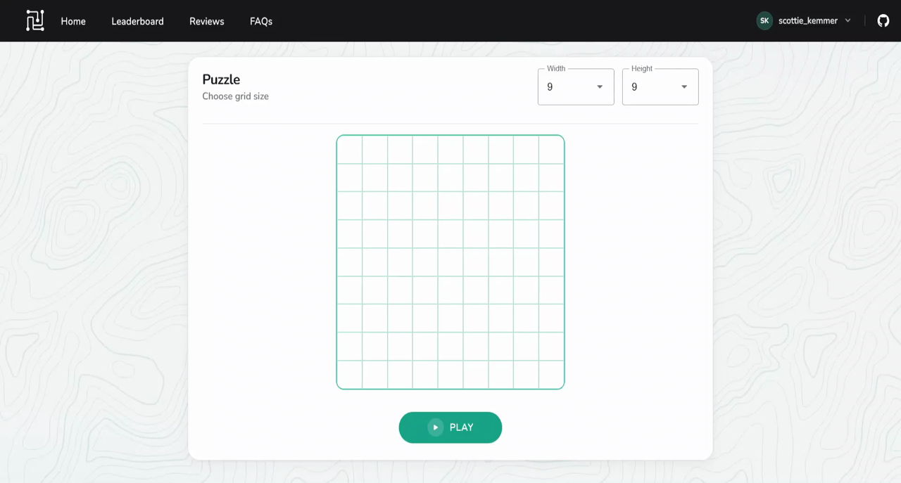
      <p>The server generates every board (<code>/api/create-map</code>) and checks every solution (<code>/api/map-check</code>), so the client can't cheat. Works with mouse and touch.</p>
    </td>
    <td width="50%" valign="top">
      <h3 align="center">Hints</h3>
      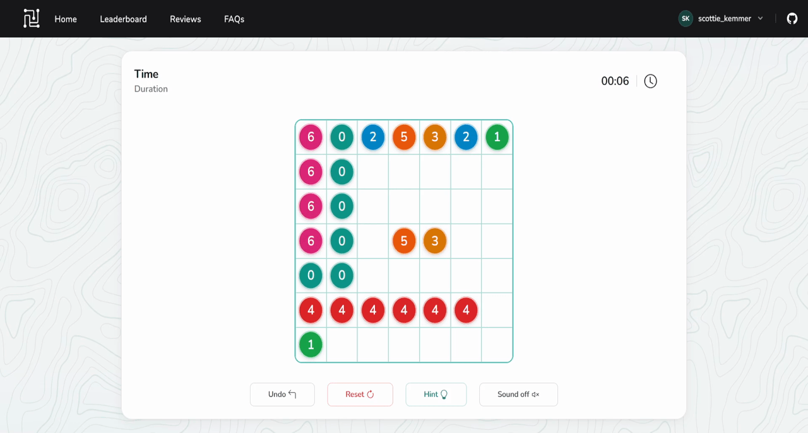
      <p>Stuck? Ask for a hint. The engine reads the current board (<code>/api/hint-check</code>) and points to a valid next move. Your score records how many hints you used.</p>
    </td>
  </tr>
  <tr>
    <td width="50%" valign="top">
      <h3 align="center">Share a result</h3>
      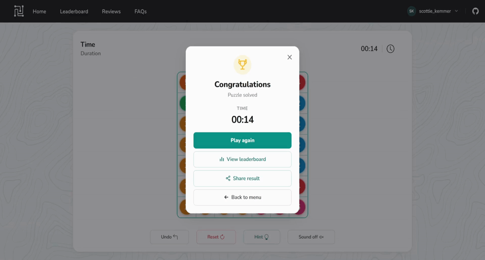
      <p>Every saved game gets a link. Switch it between <em>Private</em> and <em>Anyone with the link</em>, copy it, and revoke it later. Visitors see the result and a signup prompt.</p>
    </td>
    <td width="50%" valign="top">
      <h3 align="center">History</h3>
      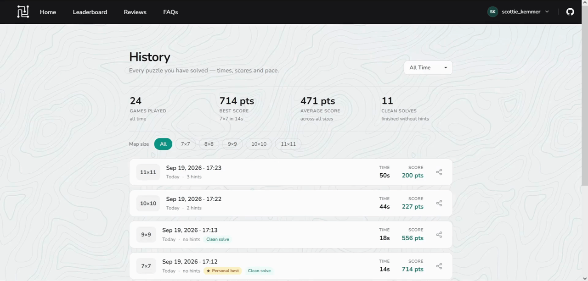
      <p>Every solved puzzle with its time, score, hints, and pace. Totals for games played, best, average, and clean solves, with filters by board size and period and personal-best badges.</p>
    </td>
  </tr>
  <tr>
    <td width="50%" valign="top">
      <h3 align="center">Leaderboard</h3>
      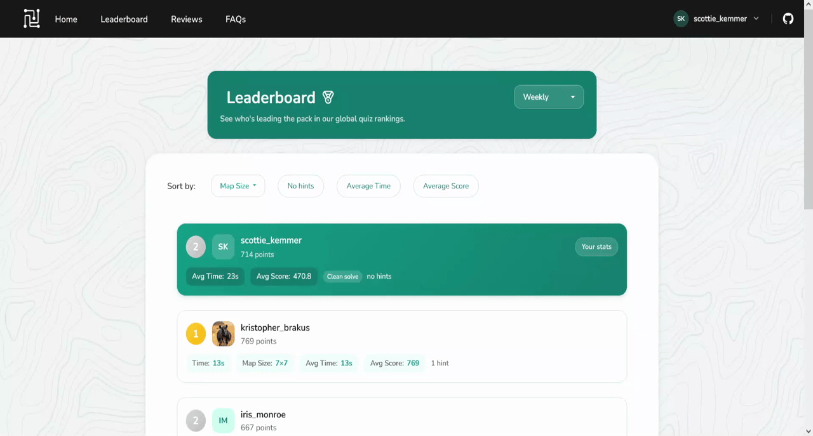
      <p>Weekly, monthly, and all-time rankings, sortable by board size, hints, average time, and average score. Your own row stays pinned. Score = <code>round(10000 / seconds)</code>.</p>
    </td>
    <td width="50%" valign="top">
      <h3 align="center">Account security</h3>
      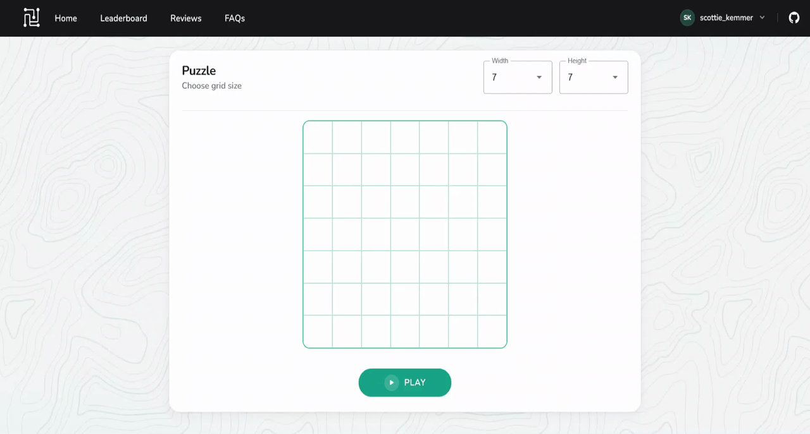
      <p>Email verification, password reset, Google and GitHub sign-in (link and unlink), two-factor authentication with an authenticator app, and a list of active sessions by device, OS, and browser, where you can sign out any other session.</p>
    </td>
  </tr>
</table>

<details>
<summary><strong>Everything else</strong></summary>

- **Guest mode:** a random display name and the full game, no account needed.
- **Reviews:** a 1–5 rating and a comment per user.
- **Profile:** username, avatar upload, password change, and email change with a confirmation link and cooldown.
- **Session epoch:** changing your password or email signs you out of every other session at once.
- **Mobile-first UI:** responsive layout, touch drawing, and modals that respect the safe area.
- **OpenAPI:** the backend serves Swagger UI at `/swagger-ui.html`.
- **Health:** `/actuator/health` with details, used by Compose healthchecks and the deploy step.
- **Metrics:** `/actuator/prometheus` (Micrometer) and an OpenTelemetry endpoint on `:9464`, both scraped by Prometheus.

</details>

## Architecture

<p align="center">
  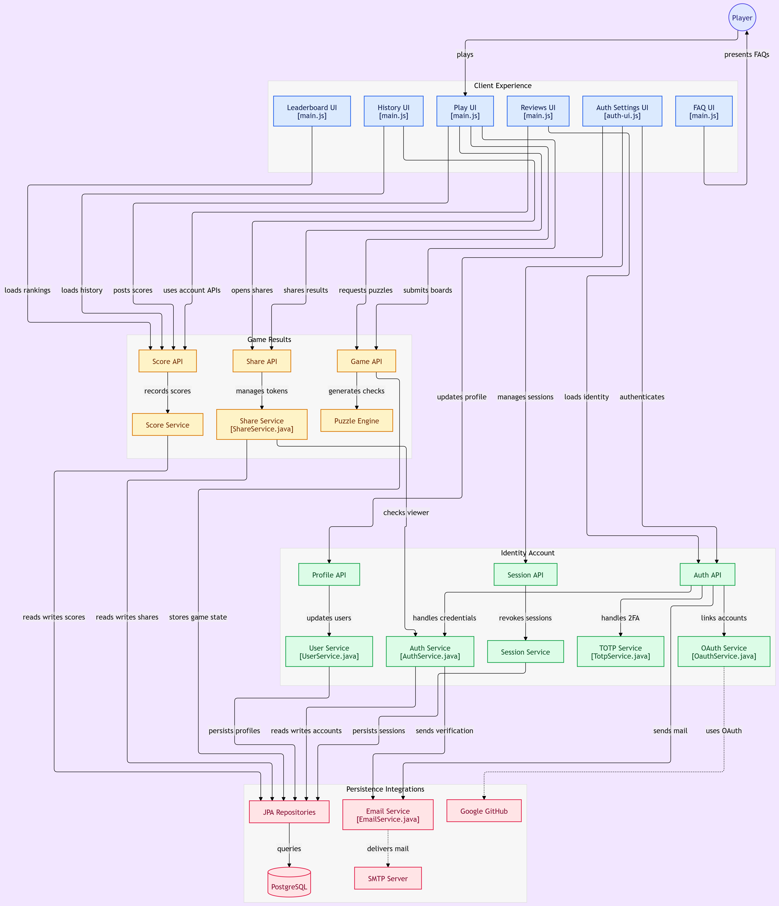
</p>

One Compose file runs two groups of services on the same Docker network: **four application services** behind a single origin, and **six observability services**.

### Application

| Service | Image | Port | Role |
|---|---|---|---|
| `nginx` | nginx 1.27-alpine | **8090** → 80 | The single entry point. Sends `/api`, `/oauth2`, `/login`, `/uploads`, `/actuator`, and `/swagger-ui` to the backend and everything else to the frontend. Writes a JSON access log, restores the visitor IP from `X-Real-IP`, and serves a loopback-only `/nginx-health` for its healthcheck. |
| `backend` | Java 21 · Spring Boot 4 | 8000 (+ 9464 metrics, internal) | REST API, puzzle engine, auth, mail, and uploads. Runs with the OpenTelemetry Java agent. Flyway migrates the schema on start (`ddl-auto=validate`). |
| `frontend` | Node 20 · Vite 8 | 7000 | Vanilla JS and Bootstrap 5. `src/` is bind-mounted, so UI edits reload without a rebuild. |
| `db` | PostgreSQL 18 | 5432 (internal) | Local development only, not published on the host. Data lives in the `pgdata` volume. Production uses Amazon RDS instead (see [Production](#production)). |

### Observability

| Service | Image | Port | Role |
|---|---|---|---|
| `grafana` | grafana/grafana | **127.0.0.1:3000** | Dashboards and Explore. Listens on loopback only, so the internet can't reach it directly (see [Production](#production)). Loads datasources and dashboards from `grafana/`. |
| `prometheus` | prom/prometheus | 9090 (internal) | Scrapes the backend (`/actuator/prometheus` and the OpenTelemetry exporter on `:9464`) and `postgres-exporter` every 3 seconds. Accepts remote writes from Tempo's metrics generator. |
| `loki` | grafana/loki | 3100 (internal) | Log store on the local filesystem with 7-day retention. Also receives OTLP logs directly from the Java agent. |
| `promtail` | grafana/promtail | — | Reads the backend log file and the nginx access log from shared volumes and ships them to Loki with `level`, `method`, and `status` labels. |
| `tempo` | grafana/tempo 2.10 | 4317 / 4318 / 3200 (internal) | Trace store with 24-hour retention. Its metrics generator turns spans into service graphs and span metrics for Prometheus. |
| `postgres-exporter` | prometheuscommunity/postgres-exporter | 9187 (internal) | PostgreSQL metrics for the database panels. |

Healthchecks enforce the startup order: `db` → `backend` (which also waits for `tempo` and `loki`) → `frontend` → `nginx`.

Named volumes: `pgdata`, `grafanadata`, `prometheusdata`, `tempodata`, `lokidata`, `backend-logs`, and `nginx-access-logs`.

<details>
<summary><strong>Tech stack</strong></summary>

**Backend:** Java 21, Spring Boot 4 (Web MVC, Data JPA, Security, OAuth2 Client, Mail, Validation, Actuator), Micrometer with `micrometer-registry-prometheus`, Flyway, Lombok, springdoc-openapi, ZXing for TOTP QR codes, and Datafaker for guest names.<br>
**Tests:** JUnit 5, Mockito, Spring Security Test, and Testcontainers (PostgreSQL). Unit tests cover the puzzle engine (`CreateMap`, `FillMap`, `ShuffleMap`, `CheckSolution`, …), and controller tests cover every REST endpoint group.<br>
**Frontend:** Vite 8, vanilla ES modules, Bootstrap 5, and Material Web components for selects. No framework.<br>
**Telemetry:** OpenTelemetry Java agent 2.31.1 (traces to Tempo over OTLP/gRPC, logs to Loki over OTLP/HTTP, metrics through a Prometheus exporter) and Promtail for log files.<br>
**Infrastructure:** Docker Compose, nginx (in Compose and on the host), Cloudflare (DNS, TLS, proxy, Zero Trust), AWS EC2 and Amazon RDS managed by **Terraform**, host setup by **Ansible**, and GitHub Actions for CI/CD and `terraform plan`/`apply`.

</details>

## Quick start

You need Docker with Compose v2, and ports **8090**, **8000**, **7000**, and **3000** free.

```bash
git clone https://github.com/ivanstavytskyi/numberlink.git
cd numberlink
cp .env.example .env
docker compose up -d --build
```

Open **http://localhost:8090** and play. The defaults in `.env.example` cover guest play, email and password accounts, and the full Grafana stack.

| URL | What |
|---|---|
| http://localhost:8090 | The game, through nginx (same origin as the API) |
| http://localhost:8090/swagger-ui.html | Swagger UI |
| http://localhost:8090/actuator/health | Health, including the database |
| http://localhost:3000 | Grafana (log in with `GRAFANA_ADMIN_USER` / `GRAFANA_ADMIN_PASSWORD`) |
| http://localhost:8090/actuator/prometheus | Raw Micrometer metrics |
| http://localhost:7000 / http://localhost:8000 | Frontend and API directly, bypassing nginx |

Prometheus, Loki, and Tempo have **no published ports**. Open them through Grafana's Explore tab.

<details>
<summary><strong>Day-to-day commands</strong></summary>

```bash
docker compose logs -f backend                 # follow API logs
docker compose up -d --build backend           # rebuild after Java changes
docker compose exec db psql -U "$DB_USER" -d "$DB_NAME"
docker compose up -d grafana prometheus loki tempo promtail postgres-exporter
docker compose down                            # stop, keep the database
docker compose down -v                         # stop and wipe Postgres + all telemetry data
```

Changes under `frontend/src/` reload on their own. Backend changes need a rebuild: the image runs `gradlew build -x test` and downloads the OpenTelemetry agent into `/otel`.

Run the backend tests locally (Testcontainers needs Docker):

```bash
cd backend && ./gradlew test
```

</details>

## Configuration

Git ignores `.env`, so create it from `.env.example`. You can leave the OAuth and SMTP blocks empty: registration with email and password still works, but verification mail, password reset, and Google or GitHub sign-in stay off until you fill them in.

| Variable | Purpose |
|---|---|
| `DB_URL`, `DB_NAME`, `DB_USER`, `DB_PASSWORD` | PostgreSQL connection. `DB_URL` is `db:5432` locally and the RDS endpoint in production. |
| `GOOGLE_CLIENT_ID`, `GOOGLE_CLIENT_SECRET` | Sign in with Google, or link a Google account |
| `GITHUB_CLIENT_ID`, `GITHUB_CLIENT_SECRET` | Sign in with GitHub, or link a GitHub account |
| `SMTP_HOST`, `SMTP_PORT`, `SMTP_USERNAME`, `SMTP_PASSWORD`, `MAIL_FROM` | Mail for verification, password reset, and email changes |
| `SMTP_STARTTLS`, `SMTP_SSL` | Port 587: `true` / `false`. Port 465: `false` / `true`. |
| `FRONTEND_BASE_URL`, `BACKEND_BASE_URL` | Public URLs for OAuth redirects and email links |
| `CORS_ALLOWED_ORIGIN_PATTERNS` | Comma-separated allowlist. Include your production domain. |
| `VITE_ALLOWED_HOSTS` | Vite's host check for production domains |
| `UPLOADS_DIR`, `AVATAR_MAX_BYTES` | Avatar storage (defaults: `uploads`, 7 MB) |
| `GRAFANA_ADMIN_USER`, `GRAFANA_ADMIN_PASSWORD` | Grafana admin account on `:3000`. **Change these before you deploy.** |

`docker-compose.yml` and `application.properties` already set the telemetry endpoints (`OTEL_*`), the metrics port `9464`, and the log file path, so they don't need `.env` entries.

OAuth apps must redirect to the **backend**, not the Vite port:

- `${BACKEND_BASE_URL}/login/oauth2/code/google`
- `${BACKEND_BASE_URL}/login/oauth2/code/github`

After a successful OAuth login, the API sends the browser back to `${FRONTEND_BASE_URL}/`.

In production, Ansible renders the same values from its vault into `.env` (`ansible/templates/env.j2`), so nobody edits configuration on the server by hand. See [Ansible](#ansible).

## API overview

The API uses cookie-based sessions. Every call that changes state needs a signed-in user unless noted otherwise. Swagger UI has the full contract. `/actuator/health` and `/actuator/prometheus` are the only public actuator endpoints.

<details>
<summary><strong>Endpoints</strong></summary>

| Area | Endpoints |
|---|---|
| Game | `GET /api/create-map` · `POST /api/map-check` · `POST /api/hint-check` · `GET /api/width` · `GET /api/height` |
| Scores | `POST /api/score` · `GET /api/score` (your best) · `GET /api/score/sort` (leaderboard) · `GET /api/score/history` |
| Share | `POST /api/share/generate` · `POST /api/share/revoke` · `GET /api/search/{token}` (public) |
| Reviews | `POST /api/rating` · `GET /api/rating/avg` · `/amount` · `/percentage` · `/comments` |
| Auth | `POST /api/register` · `/login` · `/login/2fa` · `/logout` (204 when signed in, 401 otherwise) · `/verify-email` · `/resend-verification` · `/forgot-password` · `/reset-password` · `GET /api/me` · `GET /api/generate-name` |
| Profile | `PUT /api/me/profile` · `PUT /api/me/password` · `PUT/DELETE /api/me/avatar` |
| Email change | `POST /api/me/email-change` · `/confirm` · `/resend` · `/cancel` |
| OAuth links | `POST /api/me/oauth/prepare-link` · `DELETE /api/me/oauth/{provider}` · `GET /oauth2/authorization/{provider}` |
| 2FA | `POST /api/me/2fa/setup` · `DELETE /api/me/2fa/setup` · `POST /api/me/2fa/confirm` · `POST /api/me/2fa/disable` |
| Sessions | `GET /api/me/sessions` · `DELETE /api/me/sessions/{id}` (one) · `DELETE /api/me/sessions` (all others) |
| Ops | `GET /actuator/health` · `GET /actuator/prometheus` |

</details>

## Observability

Every request produces three linked signals (a trace, its log lines, and metrics), and Grafana starts with all three already connected.

```text
backend (OTel Java agent)
  ├── traces  → Tempo      (OTLP/gRPC :4317)        → service graph, span metrics
  ├── logs    → Loki       (OTLP/HTTP /otlp/v1/logs) with trace_id in each line
  └── metrics → Prometheus (scrape :9464 and /actuator/prometheus)
nginx  → JSON access log → Promtail → Loki
db     → postgres-exporter → Prometheus
```

- **Logs link to traces.** The log pattern writes `trace_id`, `span_id`, and `trace_flags` into every line. In Grafana, each log line gets a **View Trace** link that opens the request in Tempo.
- **Dashboard.** Grafana loads *BU-MTVLAB SpringBoot Observability* from `grafana/dashboards/` on start. It shows RED metrics (rate, errors, duration), p95 and p99 latency, 2xx and 5xx share, exceptions, JVM memory and CPU, the service graph, log levels, product panels (logins, failed logins, signups, signouts), and the nginx access log.
- **Datasources.** `grafana/datasources.yaml` sets up Prometheus (default), Loki, and Tempo, with links from traces to logs and metrics, plus the service map and node graph.
- **Retention.** Loki keeps 7 days, Tempo keeps 24 hours, and Prometheus stores data in the `prometheusdata` volume.
- **Scrape targets.** `prometheus.yml` scrapes `backend:8000/actuator/prometheus`, `backend:9464/metrics`, and `postgres-exporter:9187` every 3 seconds.

<table>
  <tr>
    <td width="50%" valign="top">
      <h4 align="center">Traffic and latency</h4>
      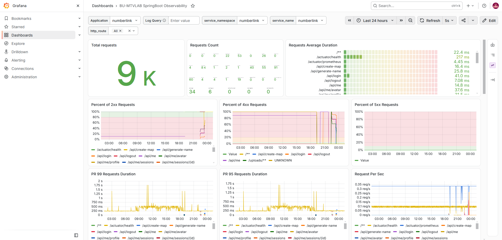
      <p align="center"><sub>Total requests, requests per endpoint, average duration, 2xx / 4xx / 5xx share, p99 / p95 latency, and request rate.</sub></p>
    </td>
    <td width="50%" valign="top">
      <h4 align="center">Logs and RED metrics</h4>
      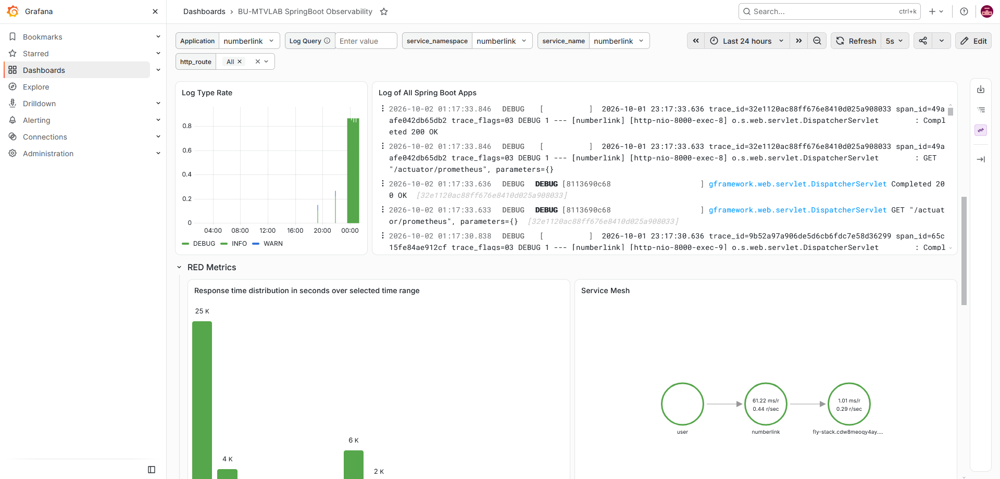
      <p align="center"><sub>Log levels and the Spring Boot log stream from Loki, response-time distribution, and the service graph Tempo builds from spans: user → numberlink → RDS.</sub></p>
    </td>
  </tr>
  <tr>
    <td width="50%" valign="top">
      <h4 align="center">Product panels and access log</h4>
      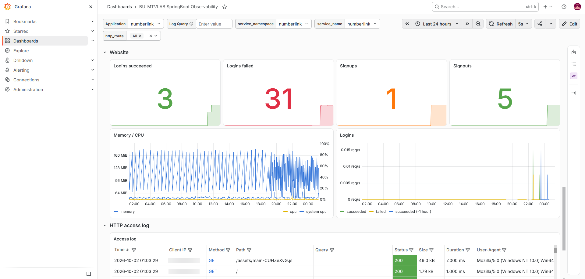
      <p align="center"><sub>Successful and failed logins, signups, signouts, JVM memory and CPU, and the nginx access log.</sub></p>
    </td>
    <td width="50%" valign="top">
      <h4 align="center">One request in Loki and Tempo</h4>
      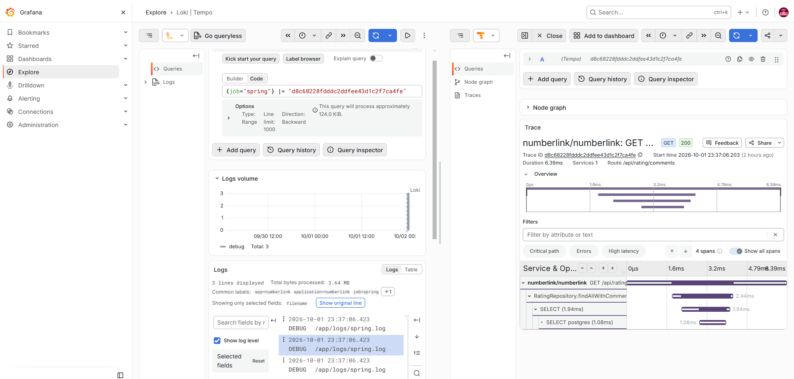
      <p align="center"><sub>Grafana Explore, split view. Left: Loki finds the three log lines with one <code>trace_id</code>. Right: Tempo shows the same <code>GET /api/rating/comments</code> down to the PostgreSQL <code>SELECT</code>, 6.4 ms in total.</sub></p>
    </td>
  </tr>
</table>

## Production

The public instance at [numberlink.fly-stack.com](https://numberlink.fly-stack.com) runs on AWS behind Cloudflare.

```text
Browser
  │  HTTPS
  ▼
Cloudflare ─── DNS · TLS · proxy / WAF · caching · Zero Trust Access (grafana.*)
  │  HTTPS :443
  ▼
EC2 host nginx ─── Let's Encrypt (DNS-01 via Cloudflare), vhosts:
  │     apex + www  → static landing page
  │     numberlink.* → 127.0.0.1:8090   (Compose nginx)
  │     grafana.*    → 127.0.0.1:3000   (Grafana, loopback-bound)
  ▼
Docker Compose on EC2 ─── nginx → backend · frontend  +  grafana · prometheus · loki · tempo · promtail
  │  5432 (private VPC, RDS-client security group)
  ▼
Amazon RDS for PostgreSQL 18 ─── managed backups, storage autoscaling, KMS, Performance Insights
```

- **Cloudflare** handles the domain: DNS, edge TLS, and proxying.
- **Forwarded headers.** Both nginx layers pass `X-Forwarded-Proto`, so Spring builds correct `https://` redirects and cookies. The host nginx also passes `CF-Connecting-IP`, which the access log records as the real client IP.
- **EC2** runs every container except `db`. In production, `DB_URL` points to RDS.
- **Grafana** never listens on a public interface. The only way in is the `grafana.*` vhost behind Cloudflare Zero Trust.
- **Security groups** open only ports 22, 80, and 443 on the instance. RDS accepts port 5432 only from the instance. See [Infrastructure as code](#infrastructure-as-code).
- **State** lives in RDS, plus avatar uploads and telemetry volumes on the EC2 disk. Flyway applies migrations to RDS on every backend start.

<table>
  <tr>
    <td width="55%" valign="top">
      <h4 align="center">Cloudflare</h4>
      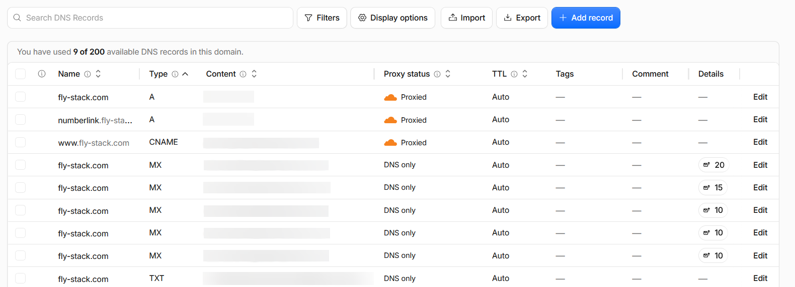
      <p align="center"><sub>Site records go through the Cloudflare proxy (orange cloud). Mail records are DNS-only.</sub></p>
    </td>
    <td width="45%" valign="top">
      <h4 align="center">AWS</h4>
      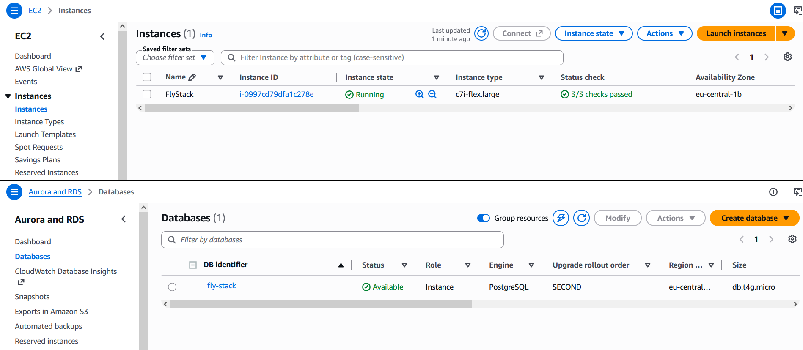
      <p align="center"><sub>The EC2 instance and the RDS PostgreSQL instance, both in <code>eu-central-1</code>.</sub></p>
    </td>
  </tr>
</table>

### Zero Trust access to Grafana

Grafana isn't public. Cloudflare Zero Trust checks every visitor against an email allowlist before any request reaches the server. The dashboard works from any device, without opening port 3000 or setting up a VPN.

<table>
  <tr>
    <td width="50%" valign="top">
      <h4 align="center">Access application</h4>
      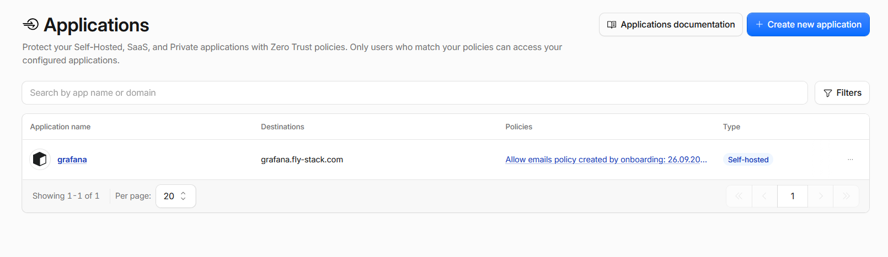
      <p align="center"><sub><code>grafana.fly-stack.com</code> as a self-hosted Access application with an email allowlist policy.</sub></p>
    </td>
    <td width="50%" valign="top">
      <h4 align="center">Sign-in page</h4>
      
      <p align="center"><sub>Visitors sign in with Cloudflare first. Grafana's own login comes second.</sub></p>
    </td>
  </tr>
</table>

### Continuous deployment

Every push to `main` runs the backend tests and the frontend build in GitHub Actions. If both pass, the workflow:

1. Connects to the EC2 instance over SSH and pulls `main`.
2. Rebuilds the whole stack, app and observability, with `docker compose up -d --build --remove-orphans`.
3. Waits for `/actuator/health` on port 8090 and Grafana's `/api/health` on port 3000.

Infrastructure changes have their own workflow: `terraform.yml` runs a plan on every pull request and applies it on `main`. See [Terraform](#terraform).

<p align="center">
  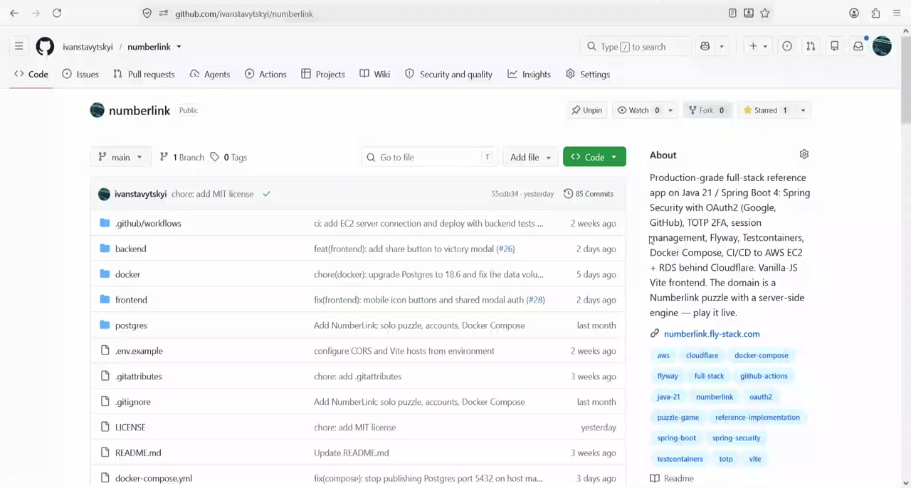
</p>

## Infrastructure as code

Terraform creates the AWS resources, Ansible sets up the Ubuntu host, and GitHub Actions handles everyday app deploys.

### Terraform

Everything lives in `terraform/`.

| Path | What |
|---|---|
| `bootstrap/state-bucket.yaml` | One-time CloudFormation stack: a versioned, encrypted S3 bucket for Terraform state, HTTPS-only |
| `bootstrap/github-oidc.yaml` | One-time CloudFormation stack: an OpenID Connect (OIDC) provider and IAM role, so GitHub Actions can use AWS without long-lived keys |
| `modules/network` | Security groups: one for the app (ports 22, 80, and 443 only), one that marks the instance as an RDS client, and one for RDS that allows port 5432 **only** from that client group |
| `modules/ec2` | The instance, its Elastic IP, and the key pair |
| `modules/rds` | Private PostgreSQL with backups, storage autoscaling, KMS encryption, Performance Insights, and enhanced monitoring |
| `config.auto.tfvars` | Non-secret settings for the live `eu-central-1` stack |
| `outputs.tf` | `public_ip` (for Cloudflare and the `EC2_HOST` secret), `rds_endpoint`, `db_url` (for the Ansible vault), and `instance_id` |

**Network exposure.** These are the only inbound rules:

| Target | Port | Source | Why |
|---|---|---|---|
| EC2 instance | 22/tcp | `0.0.0.0/0` | SSH for Ansible and the deploy step |
| EC2 instance | 80/tcp | `0.0.0.0/0` | Host nginx, redirects to HTTPS |
| EC2 instance | 443/tcp | `0.0.0.0/0` | Host nginx: the app, Grafana, and the landing page |
| RDS instance | 5432/tcp | the instance's `rds-client` security group only | PostgreSQL from the app host, never from the internet |

Ports **3000** (Grafana), **7000** (Vite), **8000** (API), **8090** (Compose nginx), **587**, and ICMP aren't open. `terraform apply` removes them from the imported security group. These services are reachable only through the host nginx on port 443, and Grafana also sits behind Cloudflare Zero Trust. Outbound traffic is unrestricted.

**Versions and secrets.** Terraform 1.11 or later, the AWS provider `~> 5.0`, and an S3 backend. Secrets never go into the repo: `ssh_public_key` and `db_password` come from GitHub Secrets as `TF_VAR_*`, and Git ignores `terraform.tfvars`, `*.tfstate`, `.terraform/`, and plan files.

**Workflow.** `.github/workflows/terraform.yml` runs `fmt -check`, `validate`, and `plan` on every pull request that touches `terraform/**`. On a push to `main`, it plans again and applies the plan in the `production` environment, which requires a reviewer's approval.

**Existing account.** To manage resources that already exist, import them first. [`terraform/README.md`](terraform/README.md) lists the import commands and the plan to expect.

### Ansible

`ansible/site.yml` turns a clean Ubuntu EC2 instance into a running server in one pass. Use tags to run only part of it:

| Tag | What it does |
|---|---|
| `base` | Adds a 2 GB swap file and installs base packages |
| `docker` | Installs Docker Engine and the Compose plugin, and adds `ubuntu` to the `docker` group |
| `tls` | Gets one Let's Encrypt certificate for the apex domain, `www`, the app, and Grafana through Certbot's Cloudflare DNS plugin |
| `nginx` | Sets up host vhosts: the landing page on the apex, the app on `127.0.0.1:8090`, Grafana on `127.0.0.1:3000`, and HTTP-to-HTTPS redirects |
| `app` | Clones the repo to `~/numberlink-service/numberlink`, writes `.env` from the vault, runs `docker compose up -d --build`, and waits for the app and Grafana to report healthy |

Secrets live in an `ansible-vault` file. The bootstrap script never downloads it, so copy it to the server yourself:

```bash
# from your laptop
ssh ubuntu@EC2 'mkdir -p ~/numberlink-service'
scp vault.yml ubuntu@EC2:~/numberlink-service/vault.yml

# on the EC2 instance
curl -fsSL https://raw.githubusercontent.com/ivanstavytskyi/numberlink/main/ansible/run.sh | bash
```

Start from [`ansible/vault.yml.example`](ansible/vault.yml.example). Hosts, ports, and paths are in [`ansible/group_vars/all.yml`](ansible/group_vars/all.yml).

### Hosting your own copy

1. Deploy the two CloudFormation templates from `terraform/bootstrap/` in an empty AWS account.
2. Apply the Terraform stack.
3. Point your DNS at the `public_ip` output.
4. Set your domain in `ansible/group_vars/all.yml`. Ansible derives the public URLs, CORS, and Vite hosts from it.
5. Fill in `vault.yml` with the `db_url` output, the database password, the Grafana credentials, and your OAuth and SMTP keys.
6. Copy the vault to the instance and run the Ansible playbook (see [Ansible](#ansible)).

[`terraform/README.md`](terraform/README.md) and [`ansible/README.md`](ansible/README.md) cover each step in detail.

## Repository layout

```text
numberlink/
├── .github/workflows/
│   ├── ci.yml                 backend tests → frontend build → SSH deploy to EC2 on main
│   └── terraform.yml          PR: fmt/validate/plan · main: apply in the production environment
├── LICENSE                    MIT
├── docker-compose.yml         app (nginx · backend · frontend · db) + observability (grafana ·
│                              prometheus · loki · promtail · tempo · postgres-exporter)
├── docker/                    Dockerfiles + nginx config (JSON access log, real-IP, health route)
├── prometheus.yml             scrape jobs: backend actuator, backend OTel :9464, postgres-exporter
├── loki-config.yaml           single-binary Loki, filesystem storage, 168h retention
├── promtail-config.yaml       tails Spring log + nginx JSON access log
├── tempo.yaml                 OTLP receivers, 24h block retention, metrics generator
├── grafana/
│   ├── datasources.yaml       Prometheus · Loki · Tempo, with traces↔logs↔metrics links
│   ├── dashboards.yaml        file provider for /etc/grafana/dashboards
│   └── dashboards/            BU-MTVLAB SpringBoot Observability dashboard
├── terraform/                 EC2 · RDS · security groups, S3 state, CloudFormation bootstrap
│   ├── modules/{network,ec2,rds}
│   └── bootstrap/             state bucket + GitHub OIDC role
├── ansible/                   first-time host provisioning (swap, Docker, Certbot, nginx, compose)
│   ├── site.yml               tags: base · docker · tls · nginx · app
│   ├── group_vars/all.yml     domain, hosts, ports, paths
│   └── templates/             .env and host nginx vhosts
├── backend/                   Spring Boot (Gradle); Flyway under src/main/resources/db/migration (V1–V14)
├── frontend/                  Vite, root = src/
│   └── src/
│       ├── index.html         Play
│       ├── leaderboard/       Weekly / monthly / all-time rankings
│       ├── history/           Your games, stats, share
│       ├── reviews/           Ratings and comments
│       ├── faqs/              Static FAQ
│       ├── verify/            Email-confirmation landing page
│       └── shared/            Auth UI, settings panel, share modal, nav, API helpers
├── postgres/                  schema.sql for a brand-new volume; Flyway owns later changes
└── docs/media/                Architecture diagram, GIFs and screenshots used in this README
```

## Contributing

Issues and pull requests are welcome. Before you open a pull request:

- Add a new migration (`V{n}__*.sql`) instead of editing one that has already run.
- Run `./gradlew test`.
- Run `terraform fmt -recursive` if you changed anything in `terraform/`. CI checks it.
- Follow the existing commit style, for example `feat(frontend): …` or `fix(observability): …`.

## License

[MIT](LICENSE) © Ivan Stavytskyi. The bundled [Nunito](frontend/src/public/assets/fonts/Nunito) typeface has its own license, the [SIL Open Font License](frontend/src/public/assets/fonts/Nunito/OFL.txt).